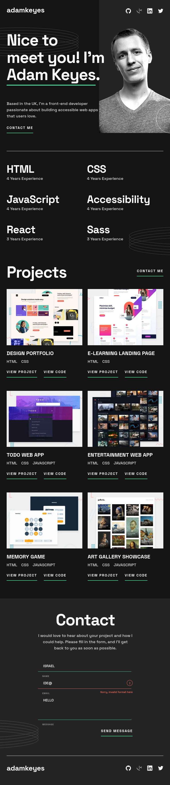
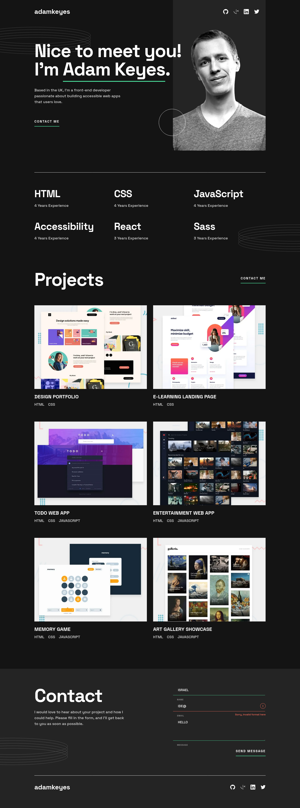

# Frontend Mentor - Single-page developer portfolio solution

This is a solution to the [Single-page developer portfolio challenge on Frontend Mentor](https://www.frontendmentor.io/challenges/singlepage-developer-portfolio-bBVj2ZPi-x). Frontend Mentor challenges help you improve your coding skills by building realistic projects.

## Table of contents

- [Overview](#overview)
  - [The challenge](#the-challenge)
  - [Screenshots](#screenshots)
  - [Links](#links)
- [My process](#my-process)
  - [Built with](#built-with)
  - [What I learned](#what-i-learned)
  - [Continued development](#continued-development)
  - [Useful resources](#useful-resources)
- [Author](#author)
- [Acknowledgments](#acknowledgments)

## Overview

### The challenge

Users should be able to:

- Receive an error message when the `form` is submitted if:
  - Any field is empty
  - The email address is not formatted correctly
- View the optimal layout for the interface depending on their device's screen size

### Screenshots





### Links

- Solution URL: [https://www.frontendmentor.io/solutions/singlepage-developer-portfolio-VzVMWhcaBG](https://www.frontendmentor.io/solutions/singlepage-developer-portfolio-VzVMWhcaBG)
- Live Site URL: [https://portfolio-ida.netlify.app/](https://portfolio-ida.netlify.app/)

## My process

### Built with

- Semantic HTML5 markup
- CSS custom properties
- Flexbox
- CSS Grid
- Mobile-first workflow
- JavaScript

### What I learned

```scss
.form {
  &__group.success &__input {
    border-bottom: 1px solid $clr-green;
  }

  &__group.error &__input {
    border-bottom: 1px solid $clr-error;
  }

  &__group.error &__small {
    opacity: 1;
    visibility: visible;
  }
}
```

```js
function showError(input, message) {
  const formGroup = input.parentElement;
  formGroup.className = "form__group error";
  const small = formGroup.querySelector("small");
  small.innerText = message;
}

function showSuccess(input) {
  const formGroup = input.parentElement;
  formGroup.className = "form__group success";
}
```

### Continued development

Eventually, I'll write the code on this page using React.

### Useful resources

- [Brad Traversy's 20 Web Projects With Vanilla JavaScript](https://www.udemy.com/course-dashboard-redirect/?course_id=2782800) - This helped me get a better grasp of how to implement the CSS and JavaScript part of the form. I really liked this pattern and will use it going forward.

## Author

- Frontend Mentor - [@mexwebdev21](https://www.frontendmentor.io/profile/mexwebdev21)
- Twitter - [@mexwebdev2121](https://www.twitter.com/mexwebdev2121)

## Acknowledgments

Shoutout to Brad Traversy - [@bradtraversy]. His teaching helped a lot with the form validation section.

An even bigger shoutout to Grace Snow [@grace-snow]. She pointed out all the mistakes I had made, and in the process this helped me learn more about accessibility.
